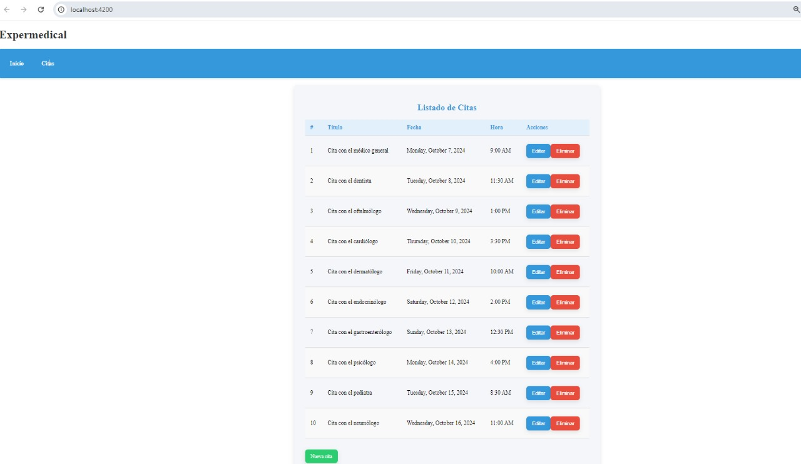

# Expertapp
Expertapp es una aplicación web desarrollada con Angular que proporciona una interfaz intuitiva para gestionar y visualizar información de manera eficiente.

## Servidor de Desarrollo

Para iniciar un servidor de desarrollo, ejecuta `ng serve` en la terminal. Luego, navega a `http://localhost:4200/`. La aplicación se recargará automáticamente si realizas cambios en los archivos de origen.

## Generación de Código

Utiliza el comando `ng generate component nombre-del-componente` para crear un nuevo componente. También puedes usar `ng generate directive|pipe|service|class|guard|interface|enum|module` para generar otros tipos de elementos en tu proyecto.

## Construcción

Ejecuta `ng build` para compilar el proyecto. Los artefactos de construcción se almacenarán en el directorio `dist/`.

## Ejecución de Pruebas Unitarias

Para ejecutar las pruebas unitarias, usa el comando `ng test`. Esto ejecutará las pruebas a través de [Karma](https://karma-runner.github.io).

## Ejecución de Pruebas de Extremo a Extremo

Ejecuta `ng e2e` para llevar a cabo las pruebas de extremo a extremo utilizando una plataforma de tu elección. Asegúrate de haber añadido primero un paquete que implemente capacidades de pruebas E2E.

## Ayuda Adicional

Si necesitas más ayuda con Angular CLI, utiliza `ng help` o visita la [Referencia de Comandos y Visión General de Angular CLI](https://angular.io/cli).

## Contribuciones

¡Las contribuciones son bienvenidas! Si deseas colaborar, por favor abre un *issue* o envía un *pull request* con tus sugerencias o mejoras.
